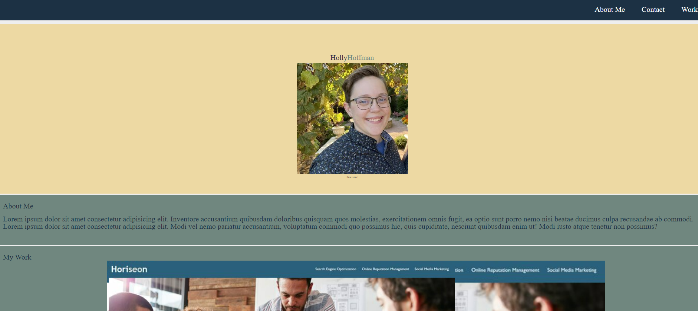

# 02-portfolio

## Description

This project is a repo for the UMN WebDev Bootcamp project which demonstrates advanced CSS. This project is meant to be a portfolio for my current and future work. This project showcases advanced layout, resource navigation, and responsive design.

## Usage
Screenshot of webpage
    

## Repo and Deployed Links
Repository link: https://github.com/hoffh-5334/02-portfolio
Deployed link: https://hoffh-5334.github.io/homework-01-code-refactor/

## License

Please refer to the LICENSE in the repo.
